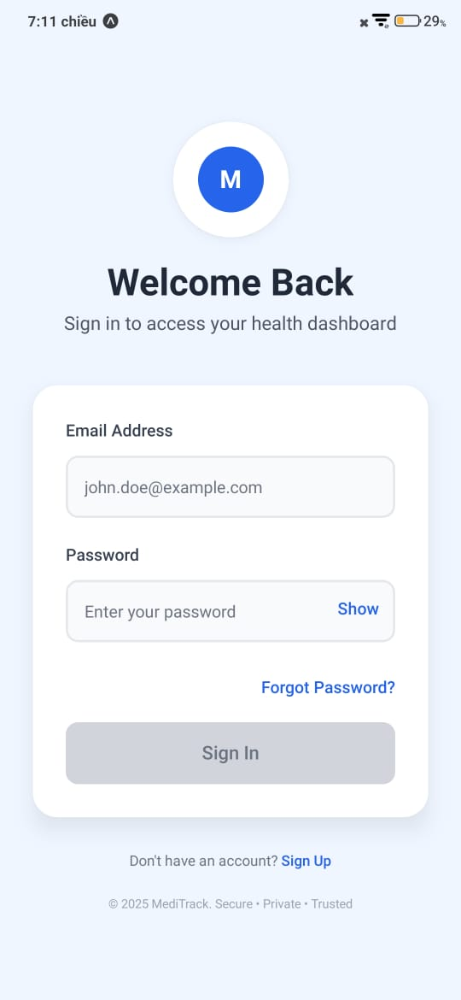
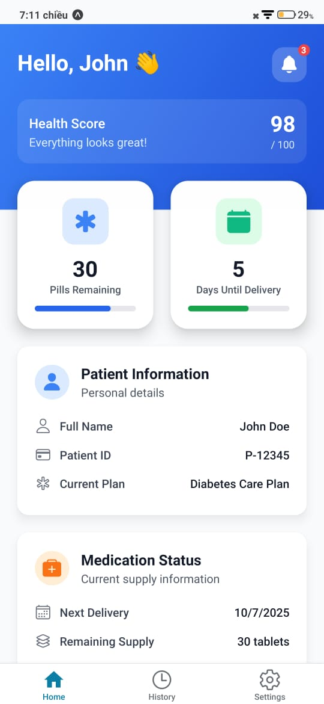
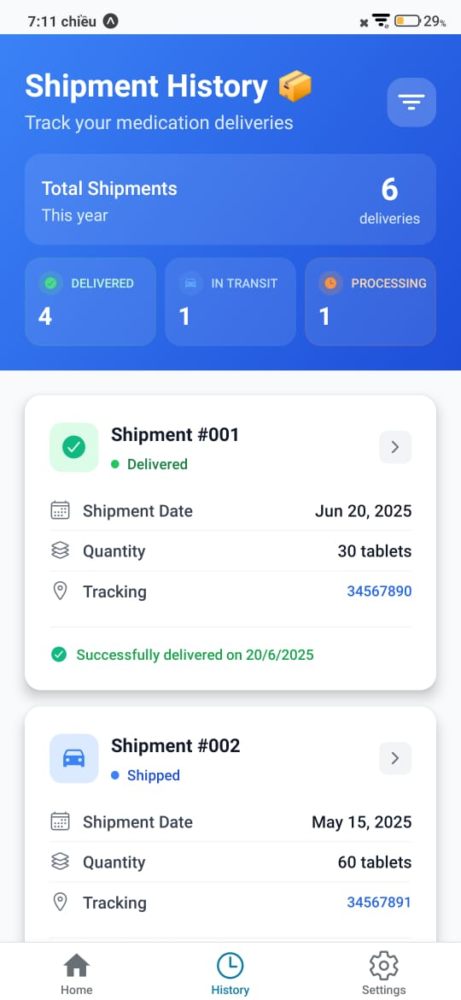
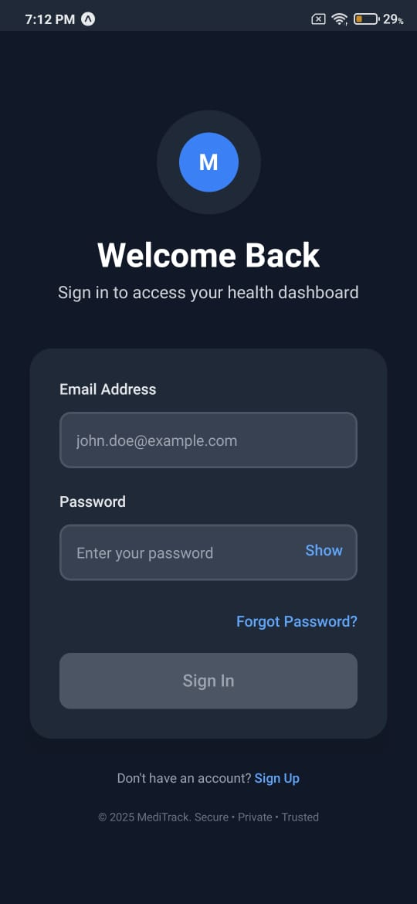
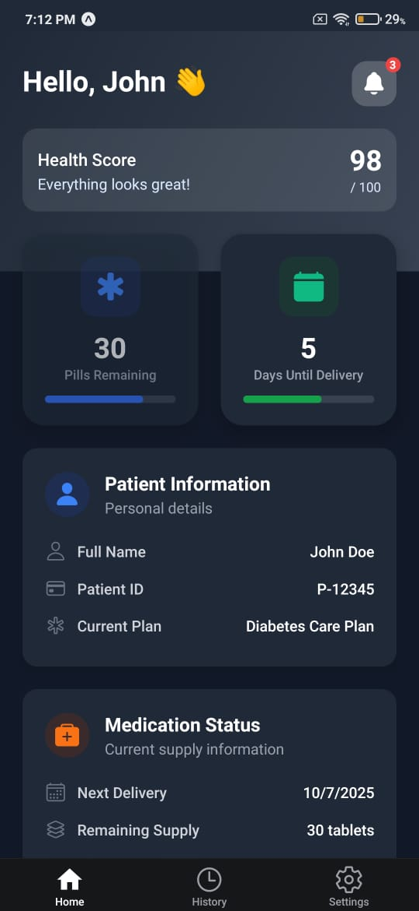
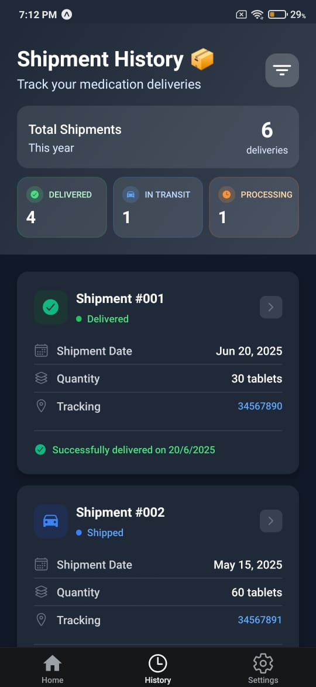

# MediTrack
A cross-platform mobile app built with **React Native + Expo**, featuring a secure login flow, patient dashboard, and shipment history.

---

## 🚀 **Features**

✅ Login screen with form validation (React Hook Form + Zod)  
✅ Zustand state management with AsyncStorage persistence  
✅ Dashboard displaying patient details and status summary  
✅ Shipment history rendered using FlashList for performance  
✅ Bottom tab navigation with Expo Router  
✅ Clean, medical-grade UI styled with NativeWind  
✅ Subtle branding animations with Moti  
✅ Logout functionality in Settings screen
✅ Integrated Sentry for error tracking and monitoring

---

## 🛠️ **Tech Stack**

- **React Native + Expo**
- **Expo Router** for navigation
- **Zustand** for state management
- **TanStack Query** for data fetching
- **NativeWind** for utility-first styling
- **FlashList** for performant lists
- **React Hook Form + Zod** for validation
- **AsyncStorage** for persistent auth state
- **Moti** for animations
- **Sentry:** For error tracking and monitoring


---

## 📸 **Screenshots**

| Login | Dashboard | Shipment History |
|---|---|---|
|  |  |  |
|---|---|---|
|  |  |  |


---

## 🎨 **Figma Designs**

- [🔗 Figma Design Link](https://www.figma.com/)  
*(Include public Figma link for Login, Dashboard, and Shipment History screens)*

---

## 📝 **Setup Instructions**

1. Clone the repository:

```bash
git clone https://github.com/MUSTAFA786ALI/MediTrack.git
cd patient-dashboard
````

2. Install dependencies:

```bash
npm install
```

3. Start the Expo project:

```bash
npx expo start
```

4. Scan the QR code with Expo Go to preview.

---

## ⚙️ **Production Deployment Plan via Expo EAS**

1. **EAS Build Profiles (`eas.json`):**

```json
{
  "build": {
    "development": { "developmentClient": true, "distribution": "internal" },
    "preview": { "distribution": "internal" },
    "production": { "distribution": "store" }
  }
}
```

2. **CI/CD Workflow:**

   * On merge to `main`, trigger `eas build --profile production`.
   * Use GitHub Actions with Expo’s EAS GitHub integration.

3. **Automated Submission:**

   * Use `eas submit` to deploy builds to the App Store and Google Play.

4. **OTA Updates:**

   * Utilize `eas update` for JavaScript-only updates directly to users.

5. **Secrets Management:**

   * Store `EXPO_TOKEN`, keystore files, and Apple credentials as CI environment secrets.

---

## 🏗️ **Architecture Decisions**

* **Expo Router:** For simple stack + tab navigation
* **Zustand:** Lightweight state management with persistence middleware
* **TanStack Query:** For fetching and caching API data efficiently
* **NativeWind:** Rapid UI development with Tailwind CSS syntax
* **AsyncStorage:** Chosen over MMKV for compatibility with Expo Managed Workflow
* **Moti:** Added for enhancing UI interactions
* **Sentry:** Integrated for real-time error tracking and monitoring to maintain app reliability in production.


---

## 🎥 **Demo Video**

* [🔗 Click here to watch the demo](https://drive.google.com/file/d/1RPI31R1XZbZa959REZ_YErTnF_bkgWPh/view?usp=sharing)

---

## 👨‍💻 **Author**

* **Name:** Syed Mustafa Ali
* **Email:** mustafaalisyed683@gmail.com
* **LinkedIn:** www.linkedin.com/in/syed-mustafa-ali-623a4920a
* **GitHub:** https://github.com/MUSTAFA786ALI/

---
